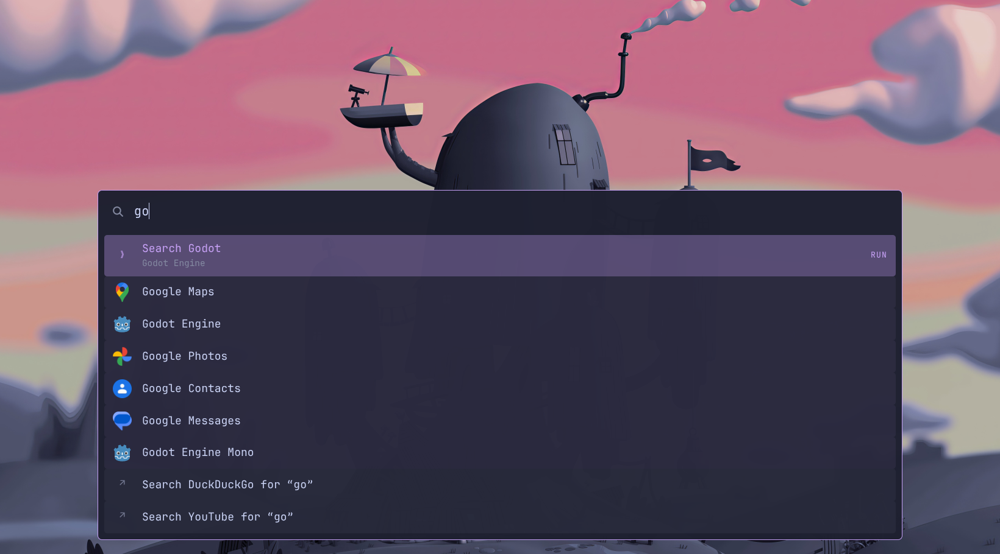
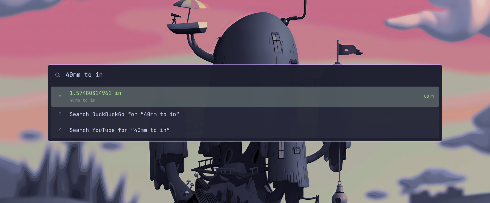
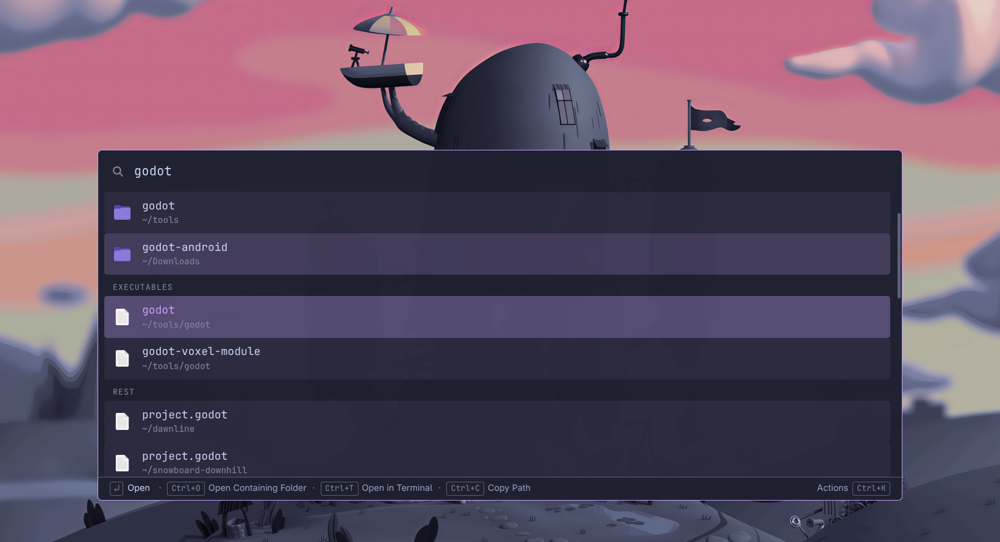
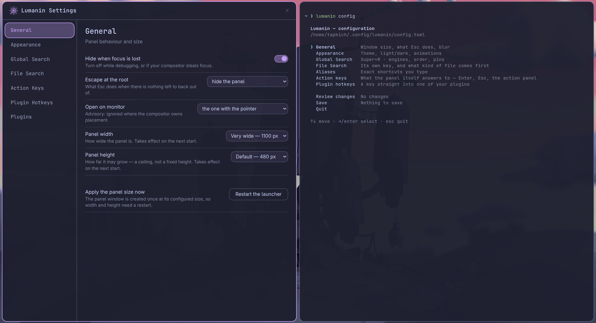

<p align="center">
  
</p>

<h1 align="center">Lumanin</h1>

<p align="center">A fast keyboard launcher for Linux. Press a key, type, hit Enter.</p>



Lumanin is a command palette for your desktop, built for Linux from the ground up. One hotkey opens the global search, which finds and launches your apps, does math and unit conversions, and runs your plugins. A second hotkey opens file search, a separate surface that browses and opens anything in your home folder, grouped by type. It stays out of the way: no dock, no tray clutter, no window until you ask.

Plugins are how it grows. Anyone can write one and publish it as a plain git repository, and if you use Claude Code there is a skill that writes a working, tested plugin for you from one sentence, in about 5 minutes and ~200k tokens.

It runs everywhere (Hyprland, KDE, GNOME, COSMIC, Sway, X11 desktops) and looks like *your* system: it picks up your desktop's colors, theme and text size automatically, and fits whatever display scale you run.

## Install

One command. No sudo required, in your home directory:

```bash
curl -fsSL https://raw.githubusercontent.com/Tapuuk/Lumanin/main/scripts/install.sh | bash
```

It builds from source into your home directory and puts `lumanin` on your PATH. You need `git` and `node`/`npm` installed. Everything else it handles.

Or, if you prefer to clone the repo, run this from the directory you cloned into. Cloning by itself installs nothing - no `lumanin` command, no settings app - until this runs:

```bash
./Lumanin/scripts/install.sh
```

(`gh repo clone Tapuuk/Lumanin && ./Lumanin/scripts/install.sh` in one go.) The `curl` one-liner above runs this same script; it only clones for you first.

> **Electron:** you do not install it. The script downloads it (about 220 MB, once) into the clone. If you skipped the script and only ran `npm ci`, the launcher has no Electron and will not start - run the script.

Then run `lumanin` once. The first-run screen lets you pick a hotkey and sets up your desktop. It shows you every file it wants to touch and asks before writing.

Update: `lumanin update`, or Settings > General > Check for updates. It pulls the checkout, rebuilds in place and restarts the launcher; nothing runs until you say yes.

Uninstall: `~/.local/share/lumanin/src/scripts/uninstall.sh`. It runs `lumanin doctor --unfix` (unwriting the keybind and autostart entry, asking first), stops the daemon and removes the symlink, icon, settings entry and checkout. Your config and plugins stay unless you add `--purge`.

## Using it

### Global search: Super+R

The main panel (the hotkey is yours to change). Everything lives here:

- Type an app's name, or part of it, and Enter launches it. What you use often floats to the top, and one typo is forgiven.
- Type math right into it: `128*1.21`, `40 mm to inches`, `20% of 350`. Enter copies the result.
- Your plugins' commands appear here too, ranked with everything else, and you can pin any of them (or any app) so it is already there before you type.
- Web search rows sit at the bottom for anything the panel can't answer itself, on every engine you enable.
- **Ctrl+K** on any result shows every action it has, with its shortcuts.



### File search: Super+Shift+R

Its own surface with its own key, so filenames never clutter the app search. It covers your whole home folder and starts searching as you type:

- Results come grouped by type: folders first, then images, videos, archives, 3D files, text, executables, and the rest. The order is yours to change.
- On a folder, Enter steps inside and you keep browsing level by level; Escape steps back out.
- On a file (a `.png`, a `.blend`, a `.pdf`, whatever), Enter opens it in the right application, and the panel gets out of the way.
- **Ctrl+K** here too: open the containing folder, open a terminal there, copy the path, copy the name.



Settings live in a real app. Run `lumanin settings` or find "Lumanin Settings" in your app grid. Hotkeys, pins, aliases, search engines, themes, plugins: all there. Prefer the terminal? `lumanin config` is the same settings as a menu.



## Plugins

A plugin is a small folder of TypeScript that adds commands to the panel: a search over your Steam library, your systemd units, your bookmarks, whatever. Anyone can publish one by pushing that folder to a public git repository. There is no store account and no review queue: the URL is the distribution.

Copy the https link of the plugin's repository (the URL in your browser's address bar works, even if it points at a folder inside a bigger repository) and:

```bash
lumanin plugin-install https://github.com/someone/their-plugin
```

Before anything is installed you're shown who wrote it, what it declares, and what it depends on, and told plainly that a plugin is a program running as you.

Find plugins: the [Lumanin-Plugins](https://github.com/Tapuuk/Lumanin-Plugins) repository is a list anyone can add theirs to by pull request. Settings > Plugins > Browse official plugins reads the same list; installing from it goes through the same consent screen as a pasted URL.

> **Careful who you install from.** A plugin runs with your full user rights: your files, your network, your session. Lumanin shows you the facts before installing, but it does not scan code and cannot catch malice. Treat a plugin URL like a `curl | bash` from the same stranger: install from authors you trust, and read the source first when you don't (the consent screen tells you exactly where it is on disk).

### Write plugins with Claude

If you use [Claude Code](https://claude.com/claude-code), install the generator skill and it writes working plugins for you: interview, code, live verification. The skill itself lives in this repository, in [`.claude/skills/lumanin-plugin/`](.claude/skills/lumanin-plugin/), and uses no agents or other machinery: plain instructions any Claude Code session can follow.

Install it by copying that folder into your skills directory:

```bash
git clone --depth 1 https://github.com/Tapuuk/Lumanin /tmp/lumanin-skill &&
  mkdir -p ~/.claude/skills &&
  cp -r /tmp/lumanin-skill/.claude/skills/lumanin-plugin ~/.claude/skills/ &&
  rm -rf /tmp/lumanin-skill
```

or, if you prefer a script that does the same thing (read it first, it's short):

```bash
curl -fsSL https://raw.githubusercontent.com/Tapuuk/Lumanin/main/scripts/install-skill.sh | bash
```

Uninstall either way: `rm -rf ~/.claude/skills/lumanin-plugin`

Then open Claude Code anywhere and type:

```
/lumanin-plugin the app or thing you want
```

It interviews you about what the plugin should do, writes it, verifies it renders real data in your real launcher, and offers to publish it when it works.

## Yes, it's Electron

Before you close the tab: we know. Here is the honest reasoning.

Plugins are the whole point of a launcher like this, and plugins need a real runtime. They talk to CLIs, read files, call APIs, render lists and forms. Ours run on Node with a React-based UI API, which means a plugin is a few dozen lines of TypeScript that anyone (or an AI) can write in minutes. A native shell would still have to bundle a JS runtime for the plugins, so you would pay Electron's cost anyway and get a second language boundary for free on top.

The thing people actually hate about Electron apps is that they are slow, and that is a choice, not a law. Lumanin runs as a daemon: the window exists before you press the key, so a toggle is drawing a window that is already there. Press to panel-on-screen is a few dozen milliseconds. It does hold more memory at idle than a C program would. That is real, and it is the trade: RAM you mostly do not notice, in exchange for instant open, one codebase across every desktop, and a plugin ecosystem with the lowest barrier to entry we could build.

If a launcher with no plugin runtime is what you want, there are excellent lighter ones. This one is built around the plugins.

## Privacy

Lumanin runs no online services, has no accounts, and sends no telemetry. Nothing you type leaves your machine unless you launch a web search. Plugin tokens you paste are stored locally and never brokered through anyone's server, ours least of all.

## Something broke?

`lumanin doctor` prints what your desktop supports and which backend Lumanin chose for each capability. Include its output in a bug report and you've answered most of our questions already. Logs live in `~/.local/state/lumanin/logs/`.

## Contributing

Build steps, the two test suites, and the conventions that come up in review are in [CONTRIBUTING.md](CONTRIBUTING.md).

## License

MIT. See [LICENSE](LICENSE) for the full text and third-party attributions.
